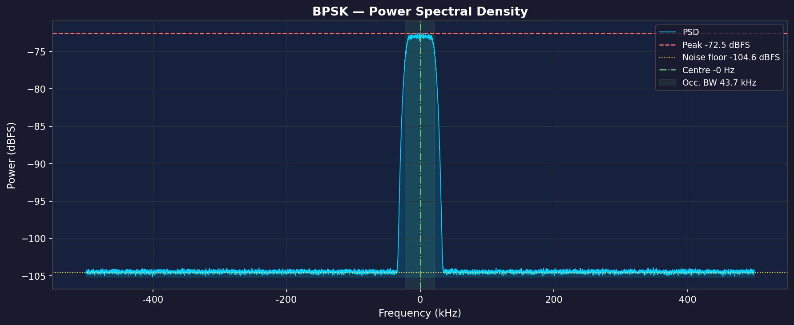
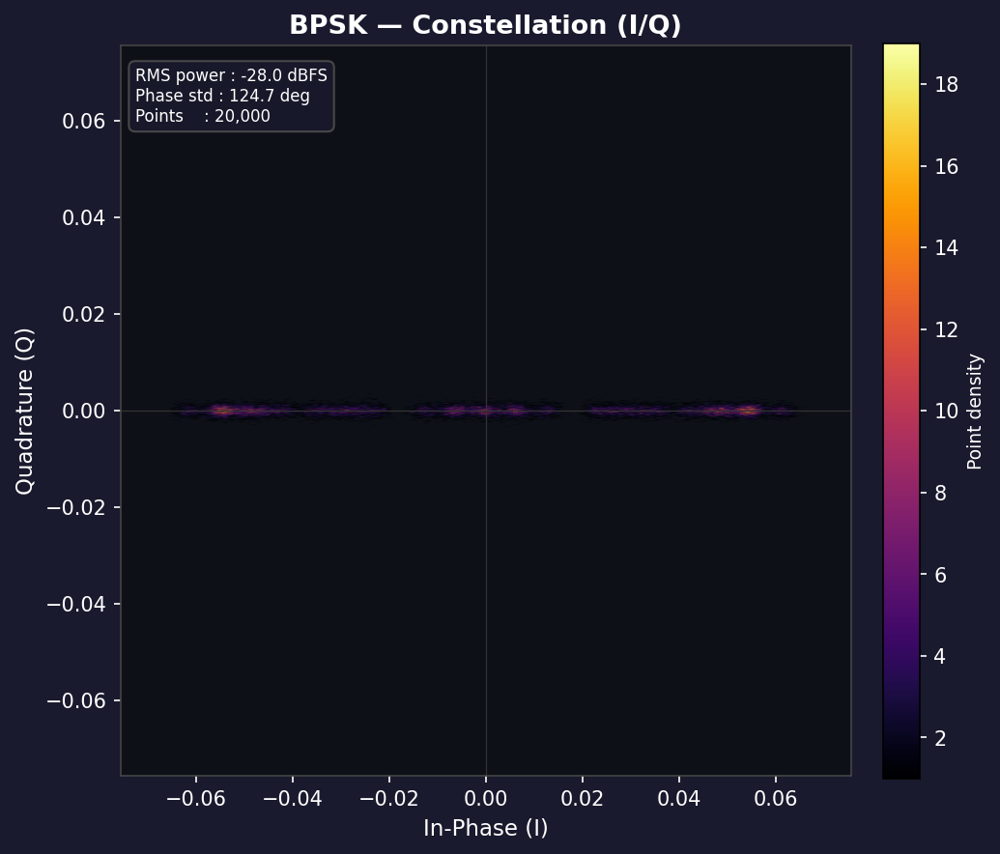
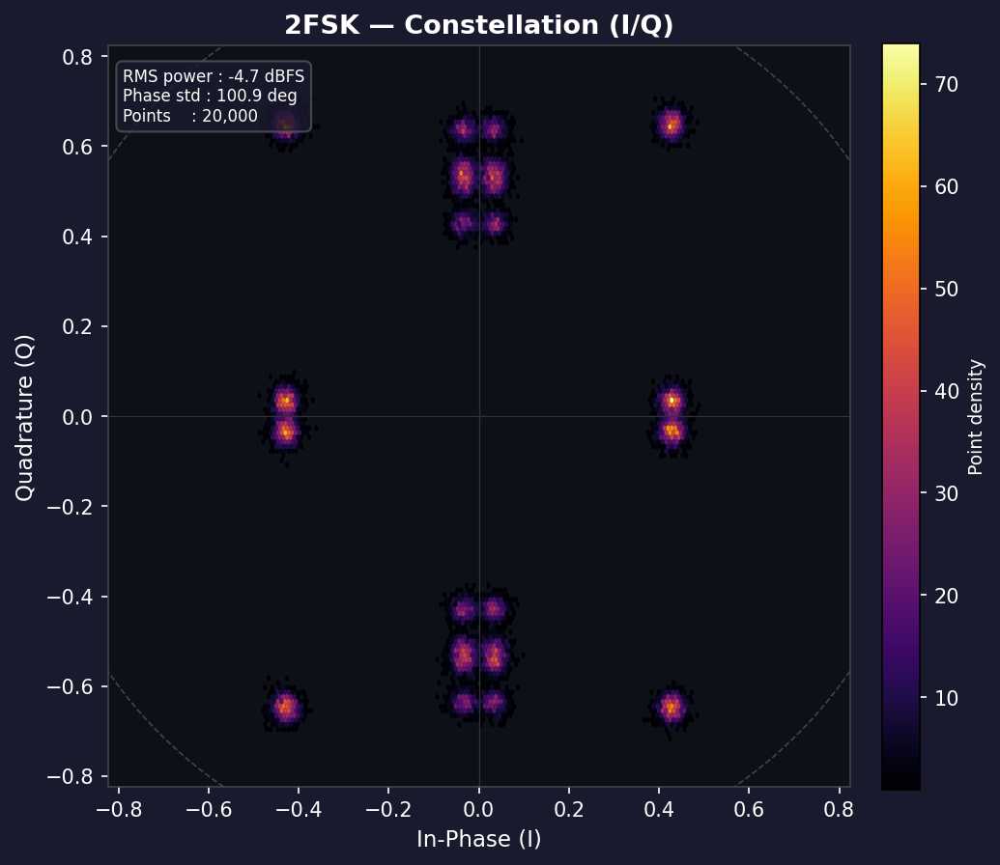
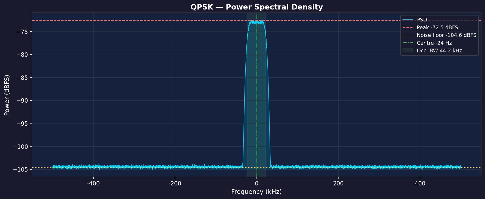
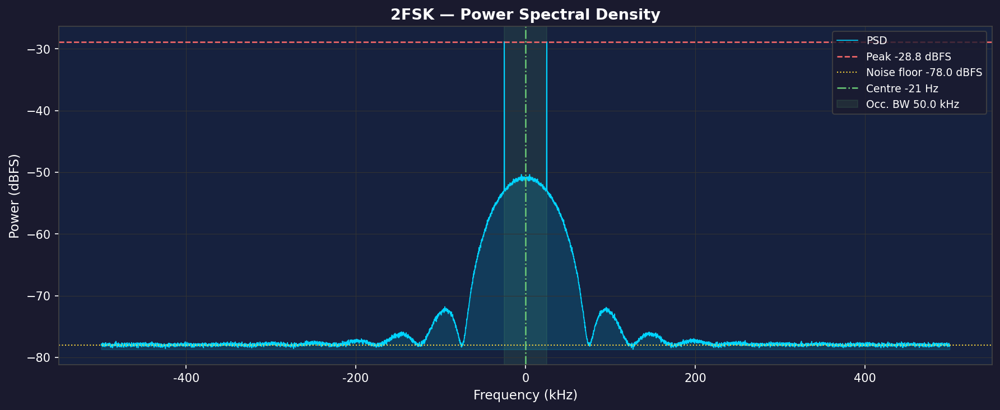

# Signal Analyzer

> **End-to-end RF signal inspection, automatic modulation classification, demodulation, synchronization, and Forward Error Correction (FEC) decoding — built as the software solution for SIH 2026 Problem Statement #26147.**

---

## Table of Contents

1. [Problem Statement](#problem-statement)
2. [Features](#features)
3. [Screenshots](#screenshots)
4. [Project Structure](#project-structure)
5. [Installation](#installation)
6. [Usage](#usage)
7. [Sample Files](#sample-files)
8. [Running Tests](#running-tests)
9. [Keyboard Shortcuts](#keyboard-shortcuts)
10. [License](#license)

---

## Problem Statement

**SIH 2026 — Problem #26147**

Design a software tool that can:
- Accept raw I/Q captures (`.iq`, `.bin`, `.wav`) from any SDR front-end.
- Automatically identify the modulation scheme without prior knowledge.
- Demodulate the baseband bitstream with carrier/timing compensation.
- Locate frame synchronisation markers and resolve phase ambiguities.
- Blind-detect and apply Forward Error Correction to recover the information payload.
- Present spectrum, waterfall, and constellation visualisations in a single operator console.

---

## Features

| Category | Capability |
|---|---|
| **Modulation Classification** | Random-Forest classifier using higher-order cumulants (C₄₀, C₄₂), envelope kurtosis, spectral symmetry — supports **BPSK, QPSK, 16QAM, 2FSK** with confidence scoring |
| **Demodulation** | Optimal carrier frequency offset (CFO) correction, Gardner/Mueller-Müller symbol timing recovery, Gray-coded constellation demapping |
| **Visualisation** | Interactive PSD spectrum, waterfall/spectrogram, and I/Q constellation plots rendered with Matplotlib embedded in PySide6 |
| **Frame Synchronisation** | Cross-correlation sync-word search (default `0xEB902A3C`, CCSDS `0x1ACFFC1D`, custom); dual-check noise-floor guard; phase-ambiguity resolution (0°/180°/90°/270°) |
| **FEC Auto-Detection** | Blind identification across Reed-Solomon (RS-64,48 / RS-32,24), LDPC (128,64 Rate-½), Concatenated RS+Viterbi, and Convolutional K=7 Rate-½ with four de-interleaver architectures |
| **FEC Decoding** | Error-correction with re-encode match metric and ground-truth BER for synthetic test files |
| **Export / Reporting** | JSON & CSV data export; single-page PDF report with metrics table + spectrum + waterfall |
| **Rate Estimation** | Cyclostationary baud-rate auto-estimation on file load with suggested Fₛ override |

---

## Screenshots

### Spectrum View — BPSK Signal



### Constellation View — BPSK & 2FSK

| BPSK | 2FSK |
|---|---|
|  |  |

### Spectrum View — QPSK & 2FSK

| QPSK PSD | 2FSK PSD |
|---|---|
|  |  |

---

## Project Structure

```
signal_analyzer/
├── main.py                  # CLI entry point (GUI + headless modes)
├── requirements.txt
├── samples/                 # Curated .iq starter files (see below)
├── docs/                    # Screenshots used in this README
│
├── gui/
│   ├── main_window.py       # PySide6 main window (~3 000 lines)
│   └── style.qss            # Dark-mode Qt stylesheet
│
├── modulation/
│   ├── classifier.py        # Feature extraction + Random Forest
│   ├── classifier_model.joblib   # Pre-trained model (ships with repo)
│   ├── demodulator.py       # BPSK/QPSK/16QAM/2FSK demod
│   ├── fec.py               # FEC orchestrator
│   ├── fec_identifier.py    # Blind FEC detector
│   ├── correlator.py        # Sync-word cross-correlator
│   ├── ldpc.py              # LDPC Min-Sum BP decoder
│   ├── rs_fec.py            # Reed-Solomon GF(2⁸) codec
│   ├── concatenated.py      # Concatenated RS+Viterbi codec
│   ├── deinterleaver.py     # Block / convolutional / diagonal de-interleavers
│   └── signal_gen.py        # Synthetic signal generator (training data)
│
├── dsp/
│   ├── spectrum.py          # Welch PSD analysis
│   ├── waterfall.py         # Short-time FFT waterfall
│   ├── constellation.py     # I/Q scatter plot
│   └── rate_estimator.py    # Cyclostationary baud-rate estimator
│
├── sig_io/
│   └── iq_reader.py         # Multi-format IQ/WAV loader
│
└── correlation/             # Low-level correlation utilities
```

---

## Installation

### Prerequisites

- **Python 3.11 or 3.12** (3.13 not yet tested with PySide6 6.x)
- A virtual environment tool (`venv` or `conda`)

### Steps

```bash
# 1. Clone the repository
git clone https://github.com/<YOUR_USERNAME>/signal-analyzer.git
cd signal-analyzer

# 2. Create and activate a virtual environment
python -m venv .venv

# Windows
.venv\Scripts\activate

# macOS / Linux
source .venv/bin/activate

# 3. Install dependencies
pip install -r requirements.txt
```

> **Note for Linux users**: PySide6 requires `libGL` and `libEGL`.
> Install with: `sudo apt install libgl1 libegl1`

---

## Usage

### Launch the GUI

```bash
python main.py
```

**With a file pre-loaded at startup:**

```bash
python main.py samples/bpsk_1000ksps_f32.iq
```

### Full Pipeline Walkthrough

1. **Open File** — Click *Open File* (`Ctrl+O`) or drag-and-drop a `.iq` / `.wav` file onto the window. Select the sample rate (defaults to 1 MHz for raw `.iq`).
2. **Classify** — Click *Classify Modulation* to identify the scheme (BPSK / QPSK / 16QAM / 2FSK) with confidence %.
3. **Demodulate** — Click *Demodulate* to recover the raw bitstream with CFO and timing correction.
4. **Find Sync** — Select a sync word from the dropdown and click *Find Sync*. Phase ambiguity is resolved automatically.
5. **Auto-Detect FEC** — Click *Auto-Detect FEC*. The blind analyzer tests RS, LDPC, Concatenated, and Convolutional families.
6. **Decode** — Click *Decode* (`Ctrl+D`) to apply the detected FEC and view the corrected payload in the Bitstream tab.
7. **Export** — Use *Export Data* (JSON/CSV) or *Save Report* (PDF/PNG) in the right sidebar.

### Headless / Batch Mode (No GUI)

Generate spectrum + waterfall + constellation PNGs for all three sample signals:

```bash
python main.py --headless all
# or for a single signal:
python main.py --headless bpsk
python main.py --headless qpsk
python main.py --headless 2fsk
```

Plots are saved to `samples/<name>_spectrum.png`, `..._waterfall.png`, `..._constellation.png`.

---

## Sample Files

Three curated `.iq` files are included in `samples/` so you can try the tool immediately without an SDR:

| File | Modulation | Sample Rate | Size |
|---|---|---|---|
| `samples/bpsk_1000ksps_f32.iq` | BPSK | 1 Msps | 128 KB |
| `samples/qpsk_1000ksps_f32.iq` | QPSK | 1 Msps | 128 KB |
| `samples/2fsk_1000ksps_f32.iq` | 2FSK | 1 Msps | 128 KB |

**Format**: Interleaved IEEE-754 float32 (I, Q, I, Q, …), no header — identical to GNU Radio `File Sink` with `float` type.

To generate additional test signals (with FEC payloads, sync words, etc.) see the generator scripts in `samples/generate_*.py` and the guide at [`GUIDE_generating_test_signals.md`](GUIDE_generating_test_signals.md).

---

## Running Tests

```bash
# Modulation classifier
python -m pytest test_demod.py -v

# FEC pipeline (RS, LDPC, Concatenated, Convolutional)
python -m pytest test_fec.py test_rs_pipeline.py test_ldpc.py -v

# Frame synchronisation regression
python verify_sync_regression.py

# All tests
python -m pytest -v
```

---

## Keyboard Shortcuts

| Shortcut | Action |
|---|---|
| `Ctrl + O` | Open signal file |
| `Ctrl + D` | Execute FEC Decode |
| `Ctrl + R` | Reset application state |
| `1` | Spectrum tab |
| `2` | Waterfall tab |
| `3` | Constellation tab |
| `4` | Bitstream tab |
| `Esc` | Dismiss alert banners |

---

## License

MIT — see [LICENSE](LICENSE) for details.
